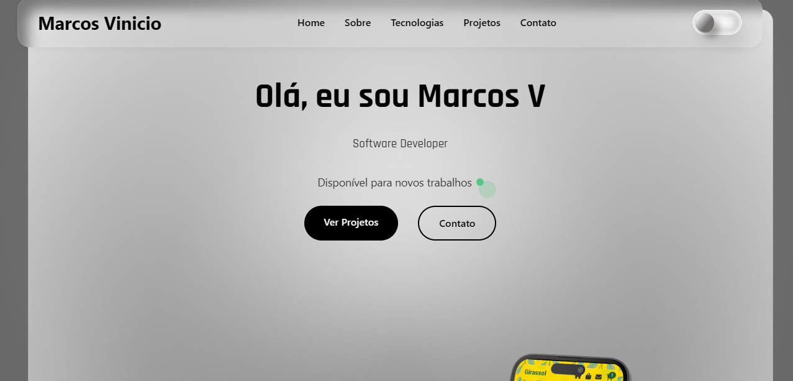

# Marcos Vinicio - Site Pessoal

Este é o meu site pessoal, onde apresento meus projetos, portfólio, experiências e formas de contato. O objetivo é fornecer uma vitrine profissional e atualizada para meu trabalho como desenvolvedor de software.

---

## Demonstração



*Acesse online:* [www.marcosvinicio.site](https://www.marcosvinicio.site)

---

## Índice

- [Sobre o Projeto](#sobre-o-projeto)  
- [Tecnologias Utilizadas](#tecnologias-utilizadas)  
- [Funcionalidades](#funcionalidades)  
- [Pré-requisitos](#pré-requisitos)  
- [Instalação](#instalação)  
- [Uso](#uso)  
- [Estrutura de Pastas](#estrutura-de-pastas)  
- [Como Contribuir](#como-contribuir)  
- [Licença](#licença)  
- [Contato](#contato)  

---

## Sobre o Projeto

O site **marcosvinicio.site** é uma plataforma pessoal construída para reunir meu portfólio, blog e informações profissionais em um único lugar. Ele visa facilitar o contato com recrutadores, parceiros e clientes, além de mostrar minhas habilidades técnicas e projetos recentes.

---

## Tecnologias Utilizadas

- **HTML5** — Estrutura das páginas.  
- **CSS3** — Estilização e responsividade.  
- **JavaScript (Vanilla)** — Funcionalidades dinâmicas.  
- **Vercel** — Hospedagem e deploy.  

---

## Funcionalidades

- Página inicial com resumo profissional.  
- Seção de projetos com descrição e links.  
- Blog com artigos técnicos e insights.  
- Formulário de contato integrado.  
- Layout responsivo.  

---

## Pré-requisitos

Antes de começar, você precisa ter instalado em sua máquina:

- **Git** ([download aqui](https://git-scm.com/downloads))  
- Um navegador moderno (Chrome, Firefox, Edge...)  
- (Opcional) Um editor de código como [VS Code](https://code.visualstudio.com/)  

---

## Instalação

1. **Clone o repositório**  
   ```bash
   git clone https://github.com/marcosvinicio10/meu-website.git
